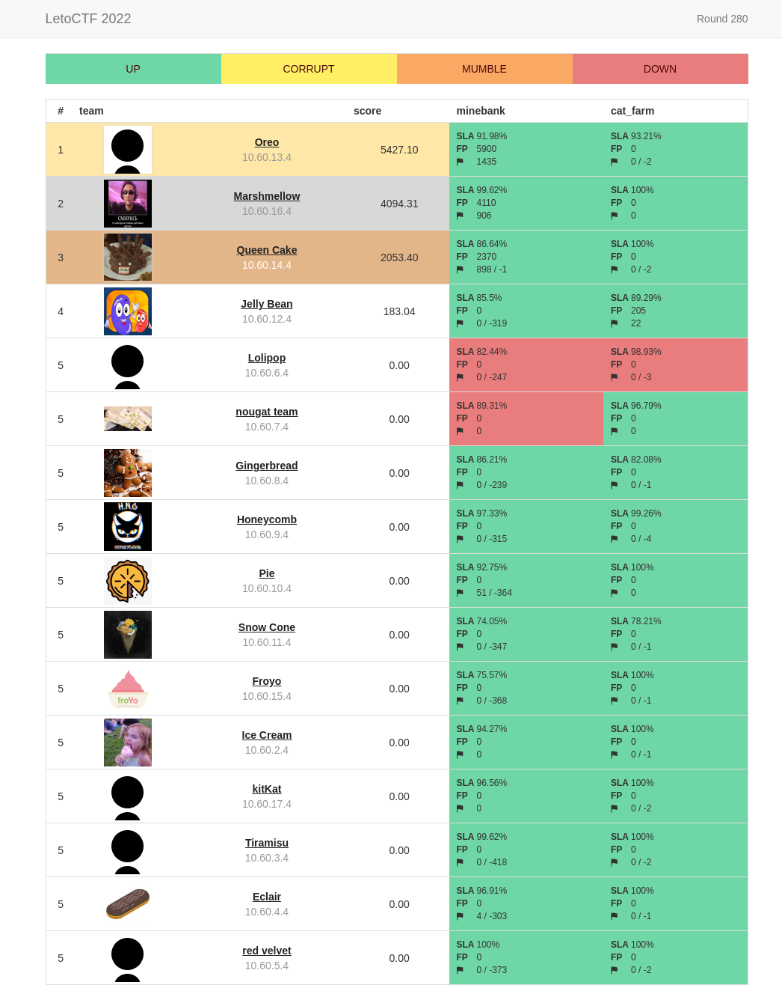
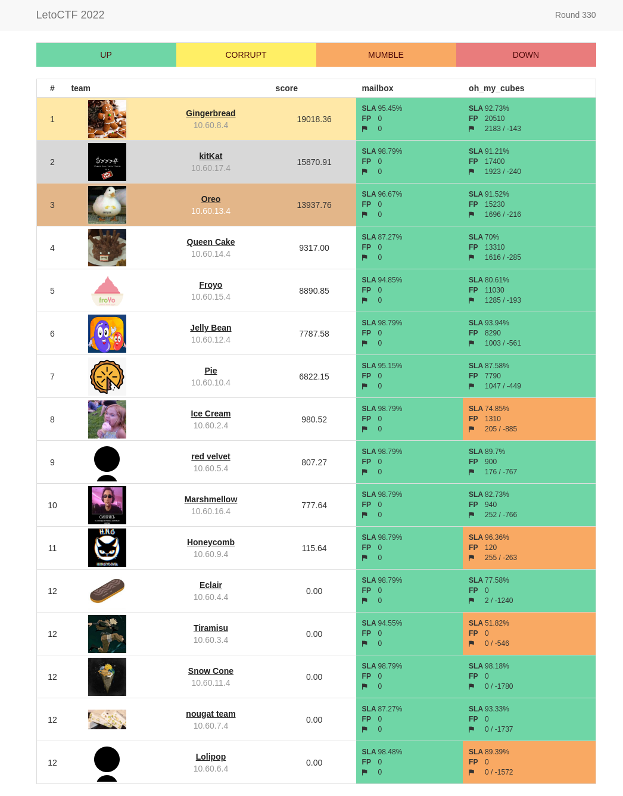

# LetoCTF 2022 A/D training

The contest is driven by classic rules (Attack-Defense [CTF](https://en.wikipedia.org/wiki/Capture_the_flag#Computer_security)). Each team is given a set of vulnerable services. Organizers regulary fill services with private information — the flags. The goal of each team is to find vulnerabilities, fix them in their services and exploit them in order to get flags from other teams.

## Day1
| Service | Language | Checker | Sploits | Authors |
|---------|----------|---------|---------|---------|
| **[minebank](services/minebank/)** | JS | [Checker](checkers/minebank/) | [Sploits](sploits/minebank/) | [@kot](https://github.com/kot) |
| **[cat_farm](services/cat_farm/)** | C# | [Checker](checkers/cat_farm/) | [Sploits](sploits/cat_farm/) | [@rx00](https://github.com/rx00) |

## Day2
| Service | Language | Checker | Sploits | Authors |
|---------|----------|---------|---------|---------|
| **[mailbox](services/mailbox/)** | Python | [Checker](checkers/mailbox/) | [Sploits](sploits/mailbox/) | [@1MiKHalyCH1](https://github.com/1MiKHalyCH1) |
| **[oh_my_cubes](services/oh_my_cubes/)** | Go | [Checker](checkers/oh_my_cubes/) | [Sploits](sploits/oh_my_cubes/) | [@capitanbanana](https://github.com/capitanbanana) |

## Infra
- [checksystem](https://github.com/HackerDom/checksystem)
- [cloud](https://github.com/HackerDom/ctf-cloud/tree/yandexcloud)

LetoCTF 2022 A/D training was held on Aug 9,10 2022.

Copyright (C) 2022 [HackerDom](https://hackerdom.ru)
